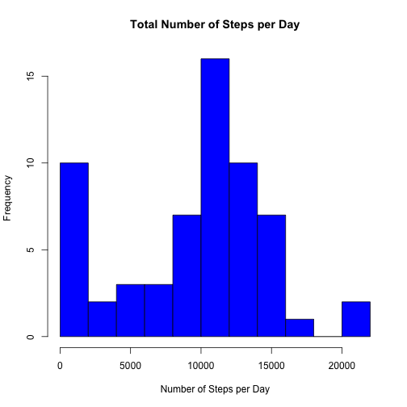
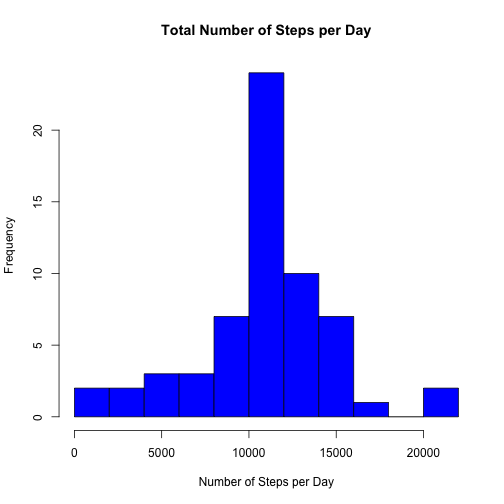

# Reproducible Research: Peer Assessment 1<br/>


## Data

The personal activity monitoring data (activity.zip [52K]) is assumed to be present in curent working directory.

This dataset includes the number of steps taken by an anonymous individual in 5 minute intervals each day during the months of October and November, 2012.

The variables included in this dataset are:

- steps: Number of steps taking in a 5-minute interval (missing values are coded as NA)

- date: The date on which the measurement was taken in YYYY-MM-DD format

- interval: Identifier for the 5-minute interval in which measurement was taken

The dataset is stored in a comma-separated-value (CSV) file and there are a total of 17,568 observations in this dataset.


## Loading and preprocessing the data

We start by unzipping and loading the dataset.
Then, we filter out incomplete cases (NAs) from dataset.


```r
activity <- read.csv(unz("activity.zip", "activity.csv"))
```

## What is mean total number of steps taken per day?

Per project instructions, <span style="background-color:yellow">for this part of the assignment, we can ignore the missing values in the dataset</span>.


```r
activity_without_NAs <- activity[complete.cases(activity),]
```

This means that we compute all values using the activity data without mising values (<b>activity_without_NAs</b>) dataset.

1. Make a histogram of the total number of steps taken each day:


```r
steps_by_date <- sapply(
  split(activity_without_NAs, activity_without_NAs$date), 
  function(x) sum(x$steps))

hist(steps_by_date, breaks = 12, main = "Total Number of Steps per Day", xlab = "Number of Steps per Day", ylab = "Frequency", col="blue")
```

 

2. Calculate and report the mean and median total number of steps taken per day


```r
mean <- mean(steps_by_date, na.rm = TRUE)
median <- median(steps_by_date, na.rm = TRUE)
```

- <span style="background-color:yellow">Mean: <b>9,354</b> steps</span>
- <span style="background-color:yellow">Median: <b>10,395</b> steps</span>

For further reference, we include below computation of Mean and Median for original data including rows with missing data (NAs):


```r
steps_by_date <- sapply(
  split(activity, activity$date), 
  function(x) sum(x$steps))

mean <- mean(steps_by_date, na.rm = TRUE)
median <- median(steps_by_date, na.rm = TRUE)
```

- <span style="background-color:yellow">Mean (including missing data): <b>10,766</b> steps</span> 
- <span style="background-color:yellow">Median (including missing data): <b>10,765</b> steps</span>

## What is the average daily activity pattern?

1. Make a time series plot (i.e. type = "l") of the 5-minute interval (x-axis) and the average number of steps taken, averaged across all days (y-axis)


```r
mean_steps_by_interval <- sapply(
  split(activity_without_NAs, activity_without_NAs$interval), 
  function(x) mean(x$steps))

x_labels <- as.numeric(labels(mean_steps_by_interval))

plot(x_labels, 
     mean_steps_by_interval, 
     type = "l", 
     xlab = "Time (minutes)", 
     ylab = "Number of steps")
```

 

2. Which 5-minute interval, on average across all the days in the dataset, contains the maximum number of steps?


```r
interval_with_max_number_of_steps_on_avg <- labels(which.max(mean_steps_by_interval))
```

- <span style="background-color:yellow">Interval with maximum number of steps on average: <b>835</b></span>

## Imputing missing values

There are a number of days/intervals where there are missing values (coded as NA). The presence of missing days may introduce bias into some calculations or summaries of the data.

1. Calculate and report the total number of missing values in the dataset (i.e. the total number of rows with NAs)

We already know that the total number of observations is 17,568.
So, we simply subtract the number of observations without missing values from this.


```r
count_of_missing_values <- 17568 - nrow(activity_without_NAs)
```

- <span style="background-color:yellow">Total number of missing values in original dataset: <b>2,304</b></span>

2. Devise a strategy for filling in all of the missing values in the dataset. 

The strategy chosen is to replace the missing values with the mean for that 5-minute interval.We will fix the original data set based on this strategy.

3. Create a new dataset that is equal to the original dataset but with the missing data filled in.


```r
activity_with_filled_in_data <- activity

for(i in 1:nrow(activity_with_filled_in_data))
{ 
  if (is.na(activity_with_filled_in_data[i, "steps"]))
  {
    activity_with_filled_in_data[i, "steps"] <- mean_steps_by_interval[toString(activity_with_filled_in_data[i, "interval"])]
  }
}
```

4. Make a histogram of the total number of steps taken each day and Calculate and report the mean and median total number of steps taken per day. 

We will compute total number of steps taken each day by using same code as above:


```r
steps_by_date <- sapply(
  split(activity_with_filled_in_data, activity_with_filled_in_data$date), 
  function(x) sum(x$steps))

hist(steps_by_date, breaks = 12, main = "Total Number of Steps per Day", xlab = "Number of Steps per Day", ylab = "Frequency", col="blue")
```

 

Similarily, we will compute Mean and Median:


```r
mean <- mean(steps_by_date, na.rm=TRUE)
median <- median(steps_by_date, na.rm=TRUE)
```

- <span style="background-color:yellow">Mean: <b>10,766</b> steps</span>
- <span style="background-color:yellow">Median: <b>10,766</b> steps</span>

Do these values differ from the estimates from the first part of the assignment? 

- ANSWER: Yes, the new Mean and Median are changed/slightly higher after imputing missing values 

    Mean:    9,354 -> 10,766<br/>
    Median: 10,395 -> 10,766

What is the impact of imputing missing data on the estimates of the total daily number of steps?

- ANSWER: After filling missing values with averages per interval, the Mean and Median have values equal (or approximately equal) to the Mean and Median of the original data (including rows with NAs).

## Are there differences in activity patterns between weekdays and weekends?

For this part the weekdays() function may be of some help here. Use the dataset with the filled-in missing values for this part.

1. Create a new factor variable in the dataset with two levels -- "weekday" and "weekend" indicating whether a given date is a weekday or weekend day.


```r
activity_with_filled_in_data$date <- as.Date(activity_with_filled_in_data$date)

for (i in 1:nrow(activity_with_filled_in_data)) {
    if (weekdays(activity_with_filled_in_data[i,2]) == "Saturday" | weekdays(activity_with_filled_in_data[i,2]) == "Sunday") {
        activity_with_filled_in_data[i, 4] <- "weekend"
    }
    else {
        activity_with_filled_in_data[i, 4] <- "weekday"
    }
}

colnames(activity_with_filled_in_data)[4] <- "day_type"
```

2. Make a panel plot containing a time series plot (i.e. type = "l") of the 5-minute interval (x-axis) and the average number of steps taken, averaged across all weekday days or weekend days (y-axis). 


```r
weekday <- activity_with_filled_in_data[activity_with_filled_in_data$day_type == "weekday",]
avg_steps_weekday <- sapply(
  split(weekday, weekday$interval),
  function(x) mean(x$steps, na.rm = TRUE))
x_labels_weekday <- as.numeric(labels(avg_steps_weekday))

weekend <- activity_with_filled_in_data[activity_with_filled_in_data$day_type == "weekend",]
avg_steps_weekend <- sapply(
  split(weekend, weekend$interval),
  function(x) mean(x$steps, na.rm = TRUE))
x_labels_weekend <- as.numeric(labels(avg_steps_weekend))

par(mfrow = c(2, 1), oma = c(1, 1, 0, 1))

plot(x_labels_weekday, avg_steps_weekday, 
     main = "Weekday", type = "l", xlab = "", ylab = "")

plot(x_labels_weekend, avg_steps_weekend, 
     main = "Weekend", type = "l", xlab = "", ylab = "")

mtext("Time Interval", outer = TRUE, side = 1)
mtext("Number of Steps", outer = TRUE, side = 2)
```

 
<br/><br/>
By comparing the two plots, we observe that the individual seems to be more active on weekends especially between minutes 1,000 and 2,000. Perhaps this indicates some kind of physical activity happening on weekends and/or a more static activity during weekdays.

